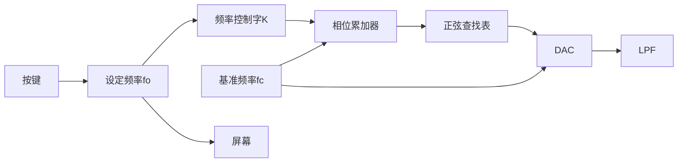

# 信号发生器

## 需求分析

基于51单片机生成正弦波信号。可用按钮调节输出频率，并在屏幕上显示设定值。

要求：

- 波形：正弦波
- 精度：优于1%
- 频率范围：1Hz~100Hz
- 分辨率：1Hz
- 人机接口：按键调整输出频率，1602上显示设定值

## 模块划分

1. 通过按键设定频率，并显示在屏幕上
2. 参考时钟fc，协调电路的各部分工作；

2. N位相位累加器，寻址波形存储器，频率控制字确定累加步长；

3. 正弦查询表(波形存储器) ，用来存储经量化和离散后的正弦函数
    的幅值；

4. D／A转换器，占空比可变的PWM波来表示模拟信号；

5. 低通滤波器，减少量化噪声、消除波形尖峰，得到所需的波形。

## 硬件电路设计

## 程序设计

## 测试报告

## 总结分析

## 电路图和程序清单

