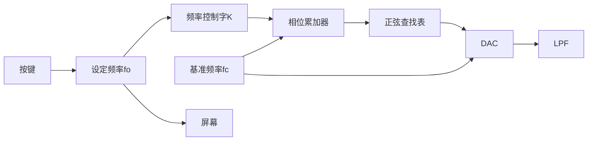
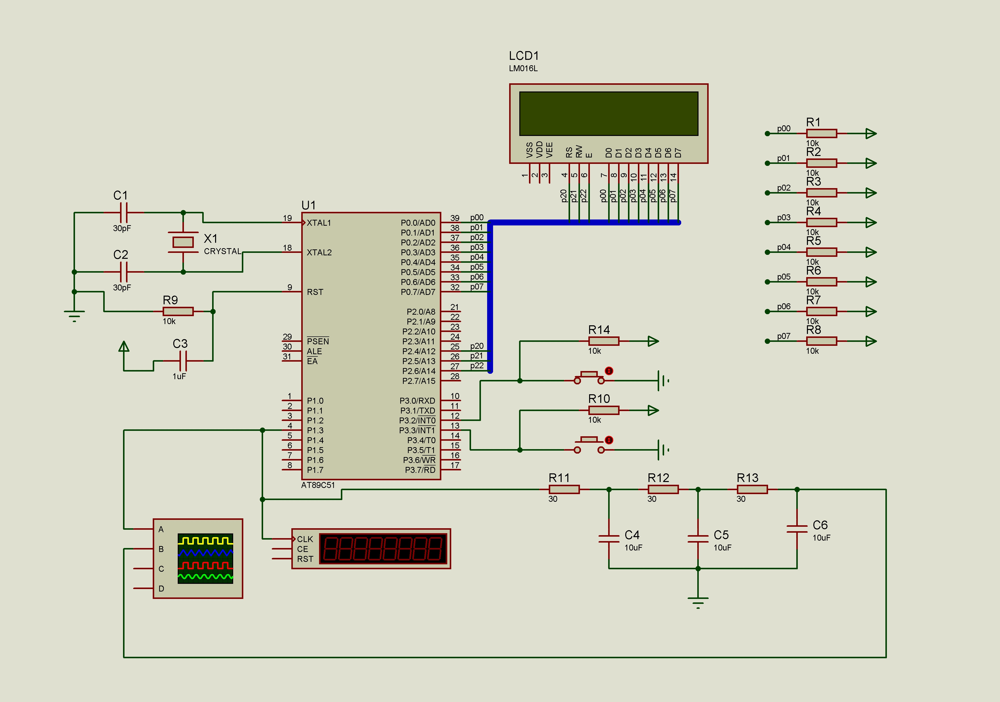

# 信号发生器

## 需求分析

基于51单片机生成正弦波信号。可用按钮调节输出频率，并在屏幕上显示设定值。

要求：

- 波形：正弦波
- 精度：优于1%
- 频率范围：1Hz~100Hz
- 分辨率：1Hz
- 人机接口：按键调整输出频率，1602上显示设定值

## 模块划分

1. 通过按键设定频率，并显示在屏幕上
2. 参考时钟fc，协调电路的各部分工作；

2. N位相位累加器，寻址波形存储器，频率控制字确定累加步长；

3. 正弦查询表(波形存储器) ，用来存储经量化和离散后的正弦函数
    的幅值；

4. D／A转换器，占空比可变的PWM波来表示模拟信号；

5. 低通滤波器，减少量化噪声、消除波形尖峰，得到所需的波形。

## 硬件电路设计

## 程序设计
对一个正弦波周期取样，取样周期为Tc，将一个周期等分M=2N份，对应将0-2pi的相位区间等分了M份。相位值依次为：2π/2^N  i(i=0∼2^N-1)将这M个点对应的正弦值量化后放到波形存储器即形成正弦查找表（若量化值为8bit，则正弦查找表大小为2^N字节）。依次在表中查找各相位值对应的正弦值并做DA输出滤波后即恢复正弦信号。

若单片机执行一次循环的的时间为Δt，相位累加器的增量为k，则M/K Δt等于周期T，1/T=k/MΔt等于频率F。设y=MΔt，则k=y×F，y可通过实验测得。
Sum是一个32位的整型变量，每次循环累加step，即相位每次向前走2πΔt/T，将该时刻的函数值传送到CCAP0H寄存器使单片机输出对应pwm波。PCA定时器使用SYSclk时钟频率为12MHz，对应的pwm波频率为46.875KHz。
误差ΔF=Δk/y，f用示波器测得211524，k为整数最小值为1，所以ΔF≈0.00000473Hz，达到设计要求。
因为正弦查找表长度只有256，所以sum要取高8位作为正弦查找表的下标。
频率显示部分使用1602，在程序初始化后显示初始频率。之后仅在频率改变时，更新显示的数值。
按键使用外部中断，用延时函数消抖。

